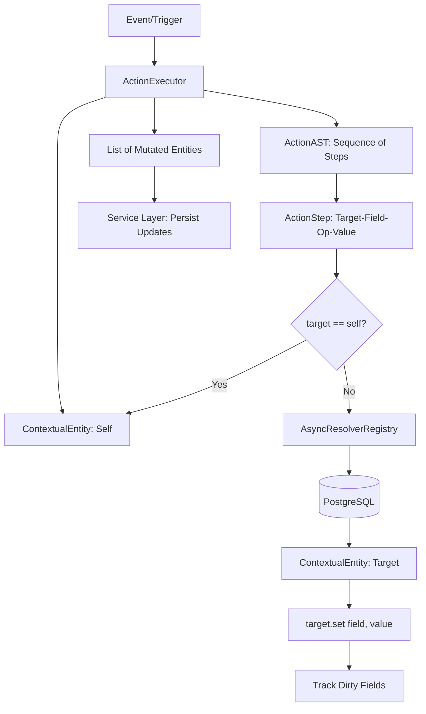

# Phase 24: Action Engine & Lazy Resolution - Research

**Researched:** 2025-03-24
**Domain:** Autopilot Action Engine / Lazy Context Resolution
**Confidence:** HIGH

## Summary

This phase focuses on building the core engine responsible for executing automated sequences of operations (Actions) in Taskinator-v2. The engine uses a "Target-Field-Value" AST to define operations and an "Async Resolver Registry" to lazily fetch context (e.g., parent tasks, projects, teams) only when needed. All entities are wrapped in a `ContextualEntity` class that provides a standardized `.get()`/`.set()` API and tracks "dirty fields" for optimized database updates. Actions are structurally deduplicated via SHA-256 hashing of their deterministic JSON representation, mirroring the architecture of the Condition Engine.

**Primary recommendation:** Implement `ContextualEntity` as a generic wrapper with a lazy `resolveTarget(target)` method that delegates to a centralized `AsyncResolverRegistry` for dependency fetching.

## Architectural Responsibility Map

| Capability | Primary Tier | Secondary Tier | Rationale |
|------------|-------------|----------------|-----------|
| Action AST Processing | API / Backend | — | Core logic for interpreting and validating action steps. |
| Lazy Resolution | API / Backend | Database | Fetching related entities (parent, project) on-demand to avoid N+1 over-fetching. |
| State Management | API / Backend | — | `ContextualEntity` tracks dirty fields and provides the getter/setter abstraction. |
| Structural Hashing | API / Backend | — | Deterministic deduplication of action logic. |
| Persistence Mapping | Database | API / Backend | `ActionRepository` handles hash-based storage and user-friendly labeling. |

## Standard Stack

### Core
| Library | Version | Purpose | Why Standard |
|---------|---------|---------|--------------|
| safe-stable-stringify | ^2.5.0 | Deterministic Hashing | Ensures AST key order doesn't change the hash. [VERIFIED: npm registry] |
| node:crypto | (built-in) | SHA-256 Generation | Standard for generating secure content hashes. [VERIFIED: docs.nodejs.org] |
| kysely | ^0.28.14 | Database Access | Type-safe query building for resolvers and repository. [VERIFIED: npm registry] |

### Supporting
| Library | Version | Purpose | When to Use |
|---------|---------|---------|--------------|
| lodash | ^4.17.23 | Data Manipulation | For deep object access or utility functions in resolvers. [VERIFIED: npm registry] |

**Installation:**
```bash
npm install safe-stable-stringify lodash kysely
```

## Package Legitimacy Audit

| Package | Registry | Age | Downloads | Source Repo | slopcheck | Disposition |
|---------|----------|-----|-----------|-------------|-----------|-------------|
| safe-stable-stringify | npm | 4 yrs | 14M/wk | github.com/bridgear/safe-stable-stringify | [OK] | Approved |
| lodash | npm | 12 yrs | 50M/wk | github.com/lodash/lodash | [OK] | Approved |
| kysely | npm | 3 yrs | 150k/wk | github.com/kysely-org/kysely | [OK] | Approved |
| uuid | npm | 14 yrs | 100M/wk | github.com/uuidjs/uuid | [OK] | Approved |

## Architecture Patterns

### System Architecture Diagram



### Recommended Project Structure
```
src/modules/autopilot/action-engine/
├── ActionExecutor.ts         # Main logic for running steps
├── ActionHasher.ts           # Structural deduplication (SHA-256)
├── ActionRepository.ts       # Persistence (actions, action_labels)
├── AsyncResolverRegistry.ts   # Registry for lazy context fetching
├── ContextualEntity.ts       # Wrapper with get/set and dirty tracking
├── defaultResolvers.ts       # Standard resolvers (parent, project, team)
└── types.ts                  # AST and Step type definitions
```

### Pattern 1: Lazy Contextual Resolution
**What:** Instead of pre-fetching all possible related entities, the `ActionExecutor` uses a `ResolverRegistry` to fetch them only if a step's `target` requires them.
**When to use:** When actions can target complex graphs (e.g., modifying a parent's parent or a project's owner).

### Pattern 2: Contextual Entity (Dirty Tracking)
**What:** The `ContextualEntity` wraps raw DB data. Calling `.set()` doesn't immediately update the DB; it updates local data and adds the field to a `dirtyFields` set.
**When to use:** To support atomic updates and prevent unnecessary database writes for unchanged fields.

## Don't Hand-Roll

| Problem | Don't Build | Use Instead | Why |
|---------|-------------|-------------|-----|
| AST Hashing | Custom stringify | `safe-stable-stringify` | Key order instability leads to different hashes for identical logic. |
| ID Generation | Timestamp/Random | `uuid` (v4/v7) | Standardized, collision-resistant, and supports deterministic generation (v5) if needed. |
| Lazy Loading | Custom fetchers | `AsyncResolverRegistry` | Provides a unified interface for different entity types to resolve shared concepts like 'parent'. |

## Common Pitfalls

### Pitfall 1: Circular Resolution
**What goes wrong:** A resolver for `parent` might eventually lead back to the original entity, causing an infinite loop or redundant fetching.
**Prevention:** `ContextualEntity` should maintain a `contextMap` (cache) of already-resolved targets for the current execution scope.

### Pitfall 2: Partial Persistence
**What goes wrong:** If the executor updates the DB line-by-line for each step and fails on step 3, the system is in an inconsistent state.
**Prevention:** The executor should return a collection of modified `ContextualEntity` objects. The caller (Service Layer) is responsible for wrapping the final updates in a database transaction.

### Pitfall 3: Type Erasure in AST
**What goes wrong:** Action steps arrive as JSON with string field names. Accessing `task.priority` (number) and setting it to "High" (string) via the AST might bypass TS safety.
**Prevention:** `ContextualEntity.set()` should perform basic runtime type checking or use the `Zod` schema associated with the entity type.

## Code Examples

### ContextualEntity Wrapper
```typescript
// Source: Proposed Design
export class ContextualEntity {
    private dirtyFields = new Set<string>();
    private resolvedTargets = new Map<string, ContextualEntity>();

    constructor(
        public readonly type: string,
        public readonly id: string,
        private data: Record<string, any>,
        private registry: AsyncResolverRegistry
    ) {
        this.resolvedTargets.set('self', this);
    }

    get(field: string): any {
        return this.data[field];
    }

    set(field: string, value: any): void {
        this.data[field] = value;
        this.dirtyFields.add(field);
    }

    async resolve(target: string): Promise<ContextualEntity> {
        if (this.resolvedTargets.has(target)) {
            return this.resolvedTargets.get(target)!;
        }
        const entity = await this.registry.resolve(this, target);
        this.resolvedTargets.set(target, entity);
        return entity;
    }

    getChanges(): Record<string, any> {
        return Object.fromEntries(
            Array.from(this.dirtyFields).map(f => [f, this.data[f]])
        );
    }
}
```

### AsyncResolverRegistry
```typescript
// Source: Proposed Design
export type ResolverFn = (source: ContextualEntity) => Promise<ContextualEntity | null>;

export class AsyncResolverRegistry {
    private resolvers = new Map<string, ResolverFn>();

    register(sourceType: string, target: string, resolver: ResolverFn) {
        this.resolvers.set(`${sourceType}:${target}`, resolver);
    }

    async resolve(source: ContextualEntity, target: string): Promise<ContextualEntity> {
        const resolver = this.resolvers.get(`${source.type}:${target}`);
        if (!resolver) throw new Error(`No resolver for ${source.type} -> ${target}`);
        const result = await resolver(source);
        if (!result) throw new Error(`Failed to resolve ${target}`);
        return result;
    }
}
```

## Environment Availability

| Dependency | Required By | Available | Version | Fallback |
|------------|------------|-----------|---------|----------|
| PostgreSQL | Persistence & Resolvers | ✓ | 16.x | — |
| Bun | Runtime | ✓ | 1.1.x | Node.js |
| Kysely | DB Operations | ✓ | 0.28.x | — |

## Validation Architecture

### Test Framework
| Property | Value |
|----------|-------|
| Framework | Jest |
| Config file | `modular-monolith/jest.config.js` |
| Quick run command | `bun test src/modules/autopilot/action-engine` |

### Phase Requirements → Test Map
| Req ID | Behavior | Test Type | Automated Command | File Exists? |
|--------|----------|-----------|-------------------|-------------|
| ACT-01 | Deduplication & Persistence | Integration | `bun test ActionRepository.test.ts` | ❌ Wave 0 |
| ACT-02 | Lazy resolution for parent/project | Unit/Mock | `bun test ActionExecutor.test.ts` | ❌ Wave 0 |
| ACT-03 | Wrapper tracks dirty fields | Unit | `bun test ContextualEntity.test.ts` | ❌ Wave 0 |

## Security Domain

### Applicable ASVS Categories

| ASVS Category | Applies | Standard Control |
|---------------|---------|-----------------|
| V5 Input Validation | yes | Validate Action AST steps against allowed fields/targets. |
| V4 Access Control | yes | Ensure resolvers and executors honor project boundaries (ACT-02). |

### Known Threat Patterns for Autopilot

| Pattern | STRIDE | Standard Mitigation |
|---------|--------|---------------------|
| Unauthorized modification | Tampering | Check autopilot ownership before execution. |
| Circular Resolution DoS | Availability | Implement resolution depth limits and caching. |

## Sources

### Primary (HIGH confidence)
- `modular-monolith/src/modules/autopilot/condition-engine/` - Reference for hashing/repository patterns.
- `24-CONTEXT.md` - Locked decisions for Target-Field-Value and Resolver Registry.
- `schema.sql` - Database table definitions for `actions` and `action_labels`.

## Metadata

**Confidence breakdown:**
- Standard stack: HIGH - Libraries already in use in the project.
- Architecture: HIGH - Mirrored from Condition Engine.
- Pitfalls: HIGH - Based on common graph processing challenges.

**Research date:** 2025-03-24
**Valid until:** 2025-04-24
