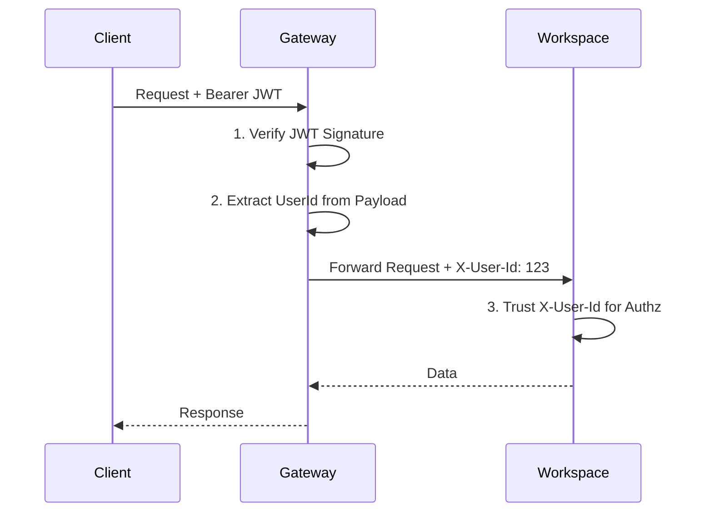

# 3. Authentication & Identity Flow (10k RPS Design)

To achieve high performance (10k+ RPS) and maintain service decoupling, Taskinator uses a **Stateless Identity Propagation** pattern.

## 1. Overview
Instead of every microservice calling the Identity service to resolve a user, the **Gateway** performs a single verification and propagates the identity downstream via trusted headers.

## 2. The Mechanics

### A. JWT Issuance (Identity Service)
The Identity service issues a JWT containing the `sub` (Subject) field set to the User's UUID. This token is signed with a private key (or shared secret).

### B. Gateway Translation (Gateway)
The Gateway acts as the "Security Guard":
1.  **Verification:** It validates the JWT expiration and signature.
2.  **Extraction:** It decodes the payload to find the `userId`.
3.  **Injection:** It injects the `X-User-Id` header.
4.  **Termination:** If the token is invalid, the Gateway rejects the request immediately, protecting downstream services from unauthorized traffic.

### C. Trusted Header (Downstream Services)
Services like `Workspace` are configured to:
1.  **Trust the Gateway:** They assume that if a request has an `X-User-Id` header, it has already been verified by the Gateway.
2.  **Context Building:** They use the header value to populate the security context for the current request.

## 3. Performance Benefits (10k RPS)
*   **Zero I/O Identity Resolution:** No network calls are required to know who the user is. Verification is a CPU-bound cryptographic operation (microseconds).
*   **Reduced Latency:** Eliminates the "Double-Hop" problem where a service waits for another service just for metadata.
*   **Scalability:** Services can scale independently without putting pressure on a central Identity database for every read/write operation.

## 4. Security Considerations
*   **Internal Network Security:** In production, the Workspace service should only accept requests from the Gateway's internal IP.
*   **Header Spoofing:** Downstream services must ignore `X-User-Id` headers if the request didn't originate from the trusted Gateway.
