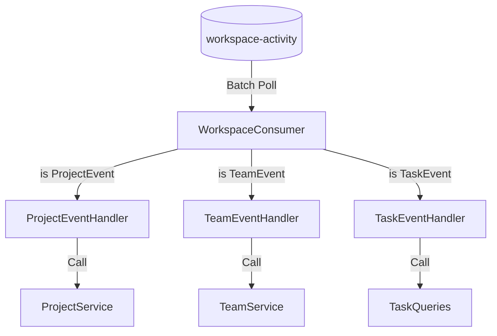

# 16. Unified Consumer Implementation Design

To resolve the causal race conditions (Wait-and-See) while maintaining a modular domain-driven architecture, we will implement a **Unified Consumer with Domain Delegation**.

## 1. Why a Single Listener? (The Partition Constraint)
In Kafka, ordering is only guaranteed within a single **Partition**. 
- If we have separate `@KafkaListener`s for Projects and Tasks in the same consumer group, Kafka will split the partitions between them. 
- *Result:* Project A (Partition 1) goes to ProjectConsumer, but Task A (Partition 1) might stay in the queue until the TaskConsumer is free. This breaks the sequential processing required to solve the race condition.

To ensure **Causal Consistency**, a single thread must process the entire sequence: 
`ProjectCreated` → `TeamCreated` → `TaskCreated`.

---

## 2. The Modular Code Structure
To avoid a "God Class" (one giant consumer), we will use the **Delegate Pattern**.

### A. The Unified Entry Point (`WorkspaceConsumer.kt`)
This class lives in a shared domain area. It is the ONLY class with the `@KafkaListener` annotation. Its only job is to:
1.  Receive the batch of `Any` events.
2.  Identify the domain (Project, Team, or Task).
3.  Forward the event to the correct **Domain Event Handler**.

### B. Domain Event Handlers
Each domain will have its own internal handler class:
- `dev.kuku.taskinator.domains.project.internal.ProjectEventHandler`
- `dev.kuku.taskinator.domains.team.internal.TeamEventHandler`
- `dev.kuku.taskinator.domains.task.internal.TaskEventHandler`

This keeps the business logic for "How to handle a ProjectCreated event" inside the Project domain, maintaining strict boundaries.

---

## 3. Data Flow Diagram

---

## 4. Error Handling & Atomicity
The entire batch is wrapped in a single **Spring `@Transactional`** block.
- If the `TaskEventHandler` fails, the `WorkspaceConsumer` transaction rolls back.
- This means the `ProjectCreated` event (from the same batch) is also rolled back in the DB.
- Kafka will then retry the entire batch.
- This ensures the database and Kafka stay perfectly in sync.

---

## 5. Execution Plan
1.  **Refactor Events**: Move events to their respective domain packages (`ProjectEvent.kt`, `TeamEvent.kt`, etc.).
2.  **Create Handlers**: Implement the internal handlers in each domain.
3.  **Implement Unified Consumer**: Create the `WorkspaceConsumer` to orchestrate the delegation.
4.  **Clean up Fetchers**: Update all Fetchers to produce to the unified topic.
