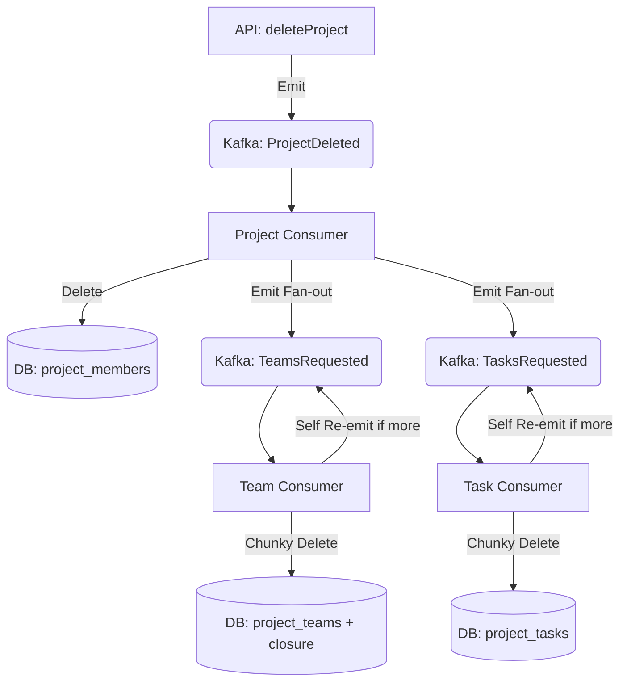

# Low-Level Design (LLD): High-Scale Cascading Cleanup

## 1. Introduction
Deleting a Project in a **10k RPS** system is a "Heavy Mutation." A single project can contain 500,000+ tasks and 1,000+ teams. Synchronous deletion (`DELETE CASCADE`) causes massive database locks, WAL bloat, and API timeouts. 

This LLD describes the **Reactive Fan-out + Chunky Delete** architecture implemented to ensure project deletions are non-blocking, resilient, and horizontally scalable.

---

## 2. System Architecture & Data Flow

### 2.1. The "Ingest-Buffer-Drain" Pipeline
1.  **Ingest (API):** `ProjectService` performs a synchronous "Light Delete" of core metadata and produces a `ProjectDeleted` event to Kafka.
2.  **Buffer (Kafka):** The `workspace-activity` topic holds the intent to delete.
3.  **Drain (Consumers):** Specialized consumers process the event, fan it out into smaller cleanup tasks, and "nibble" away at the data in chunks.

### 2.2. The Fan-out Sequence (Level 0 to Level 2)



---

## 3. Component Details

### 3.1. Project Consumer (`ProjectEventHandler`)
Acts as the **Orchestrator**. It ensures that the high-level project metadata is handled before triggering the heavy lifting.
- **Key Method:** `handle(ProjectEvent.ProjectDeleted)`
- **Responsibility:**
    1.  Synchronously purges `project_members`.
    2.  Dispatches `CleanupEvent.TeamsRequested` and `CleanupEvent.TasksRequested` to Kafka.
    3.  Uses the `projectId` as the **Kafka Partition Key** to ensure all cleanup events for a project stay in the same causal stream.

### 3.2. Task Consumer (`TaskEventHandler`)
The "Heavy Worker." It handles the largest dataset in the system.
- **Key Method:** `handleCleanup(CleanupEvent.TasksRequested)`
- **Strategy:** Uses the **Chunky Delete** pattern.
- **Logic:**
    1.  Call `taskRepo.deleteTasksByProjectBatch(projectId, limit=5000)`.
    2.  If `deletedCount == 5000`: There are likely more tasks. Re-emit the `TasksRequested` event to the end of the Kafka topic.
    3.  If `deletedCount < 5000`: Cleanup is complete. Log completion.

### 3.3. Team Consumer (`TeamEventHandler`)
Handles the hierarchical cleanup of teams and closure tables.
- **Key Method:** `handleCleanup(CleanupEvent.TeamsRequested)`
- **Strategy:** Multi-table Chunky Delete.
- **Logic:** Purges `project_team_members`, `project_team_closure`, and `project_teams` in a single batched transaction (Limit=1000).

---

## 4. Persistence Layer: The "Chunky Delete" SQL

To prevent long-running locks, we avoid `DELETE WHERE project_id = ...`. Instead, we use a **CTE (Common Table Expression)** with a `LIMIT`.

### 4.1. Task Chunky Delete (PostgreSQL)
```sql
DELETE FROM project_tasks 
WHERE id IN (
    SELECT id FROM project_tasks 
    WHERE fk_project_id = ?::uuid 
    LIMIT ?
)
```
*   **Why this works:** It targets the Primary Key (`id`) for the actual delete operation. The subquery is fast due to the `fk_project_id` index. By limiting the rows, the transaction remains short (< 100ms), allowing other queries to proceed.

### 4.2. Team Chunky Delete (PostgreSQL)
```sql
WITH target_teams AS (
    SELECT id FROM project_teams 
    WHERE fk_project_id = ?::uuid 
    LIMIT ?
),
deleted_members AS (
    DELETE FROM project_team_members 
    WHERE fk_team_id IN (SELECT id FROM target_teams)
),
deleted_closure AS (
    DELETE FROM project_team_closure 
    WHERE fk_team_id IN (SELECT id FROM target_teams) 
    OR fk_child_id IN (SELECT id FROM target_teams)
)
DELETE FROM project_teams 
WHERE id IN (SELECT id FROM target_teams)
```
*   **Why this works:** It atomically clears the entire team dependency graph for a specific slice of teams in one round trip.

---

## 5. Reliability & Performance

### 5.1. Handling Massive Projects (Self-Re-emission)
If a project has 1,000,000 tasks, a single Kafka consumer would take minutes to delete it, blocking the partition. 
- By **re-emitting** the event after every 5,000 deletions, we put the "cleanup work" back into the buffer.
- This allows the consumer to process **other projects' events** that arrived in the meantime, preventing a single large project from starving the rest of the system.

### 5.2. Idempotency
- All cleanup SQL is naturally idempotent. `DELETE` on a non-existent row is a no-op.
- If a consumer crashes after the DB commit but before acknowledging Kafka, the event is re-processed, and the `deletedCount` will simply be `0`.

### 5.3. Performance Impact at 10k RPS
- **API Latency:** Remains < 10ms (just an `INSERT` to Kafka).
- **Consumer Throughput:** Controlled by the `BATCH_SIZE`. We can tune this (5k for tasks, 1k for teams) based on DB IOPS.
- **Isolation:** The `projectId` partition key ensures that if `Project A` and `Project B` are being deleted, they can be processed by different Kafka consumer instances in parallel.

---

## 6. Implementation Checklist
- [x] Internal `CleanupEvent` defined.
- [x] `ProjectEventHandler` implements fan-out logic.
- [x] `TaskQueries` implements batched deletion.
- [x] `TeamQueries` implements batched deletion.
- [x] `WorkspaceConsumer` routes internal cleanup events.
- [x] `TaskMutationFetcher` updated to emit events.
- [x] Integration tests verify the end-to-end cascade.
