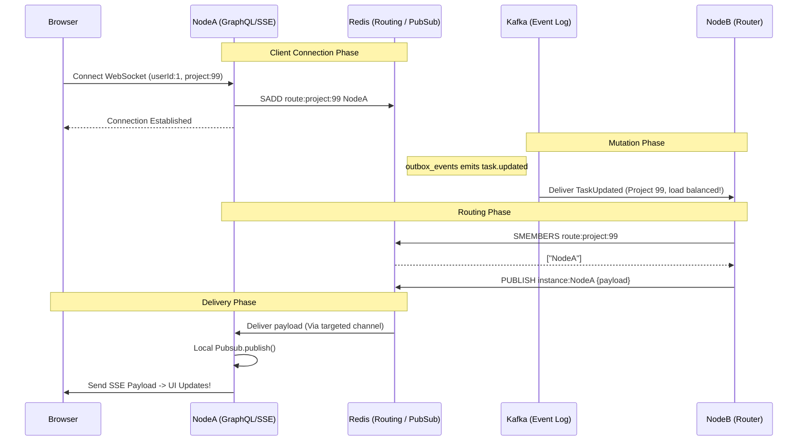

# Hyper-Scale Realtime Architecture: Redis Targeted Routing

## Overview 
The Taskinator Realtime system executes a "Targeted Routing" pattern to deliver Server-Sent Events (SSE) and WebSockets to users at hyper-scale.

Rather than relying on naive fan-out (which creates $O(N)$ networking bottlenecks across thick clusters), this architecture ensures that Kafka handles durable events exactly once, and a Redis volatile routing mesh delivers real-time notifications directly—and exclusively—to the specific hardware nodes where target users maintain open connections.

---

## 1. Node Initialization & Ephemeral Identity

When a monolithic server instance boots, it generates a globally unique, ephemeral identifier known as its `INSTANCE_ID`.
```typescript
export const INSTANCE_ID = `${os.hostname()}-${uuidv4().substring(0, 8)}`;
```
This ID represents the physical (or containerized) node in the cluster. It serves as the physical address where active, sticky WebSocket/SSE TCP connections live in memory.

---

## 2. The Redis Routing Table (Subscription Lifecycle)

When a client browser establishes a connection to the GraphQL Yoga server, the HTTP load balancer routes them to exactly one node.

Inside the `Subscription.realtimeStream` resolver, the connection executes an initialization hook:
1. It identifies the authenticated `userId`.
2. It executes a Redis `SADD` (Set Add) to register the local `INSTANCE_ID` under a routing key.
   - `SADD route:user:{userId} {INSTANCE_ID}`
   - `SADD route:project:{projectId} {INSTANCE_ID}`

This builds our volatile "Routing Table" in Redis. Redis now knows physically *where* in the world a user is connected. When the user disconnects or the network drops, a `finally` block executes an `SREM` operation to cleanly wipe the instance from the routing table.

---

## 3. The Kafka -> Redis Router (`RealtimeRouterConsumer`)

When an action occurs (e.g. User updates a task), it is written to the PostgreSQL `outbox_events` and polled onto the primary Kafka backbone topic (`project-task-events`). 

We listen to this topic using the `RealtimeRouterConsumer` class. 
Crucially, this consumer uses a **static Kafka Group ID:** `realtime-targeted-router-group`.
Because the group ID is static across all nodes, Kafka automatically load balances the event. **Only one single server in the entire cluster picks up the event.**

That specific node then acts as the network router:
1. It receives a `TaskUpdated` event for Project 123.
2. It asks Redis: *"Which physical nodes currently hold connections viewing Project 123?"*
   ```typescript
   const instances = await redisPublisher.smembers('route:project:123');
   // returns: ["server-42", "server-99"]
   ```
3. If no nodes are returned, the router drops the event (saving massive network resources).
4. If nodes are returned, the router pushes the JSON payload exclusively to those specific nodes over the internal Redis network:
   ```typescript
   redisPublisher.publish('instance:server-42', payload);
   redisPublisher.publish('instance:server-99', payload);
   ```

---

## 4. The Local Bridge Executor (`RealtimeRedisBridge`)

On every server, the `RealtimeRedisBridge` runs silently in the background. It maintains an active Redis subscriber connection scoped uniquely to its own name: 
`redisSubscriber.subscribe('instance:${INSTANCE_ID}')`.

When the router (Component 3) fires a payload to `'instance:server-42'`, the Bridge process currently running on `server-42` intercepts it. 

It takes that payload and instantly injects it into the local memory of the server:
```typescript
pubsub.publish(topic, payload);
```
GraphQL Yoga catches this payload from the local memory iterator and pushes it directly down the open TCP pipe to the user's browser.

---

## End-To-End Architecture Diagram



## Scaling Characteristics
| Bottleneck | How it is solved |
| :--- | :--- |
| **Kafka O(N) Load** | Kafka only delivers messages to exactly 1 Router instance, protecting the JVM backbone from catastrophic fan-out network overload. |
| **Dead Subscriptions** | If an event fires for a project where 0 users are online, Redis cleanly returns an empty array, and the event execution immediately halts. Zero network overhead generated. |
| **High Density Websockets** | WebSockets are notoriously memory heavy. This system allows you to scale to 10,000 backend Nodes strictly dedicated to holding sticky TCP pipes, without them processing Kafka traffic or communicating with each other. |
