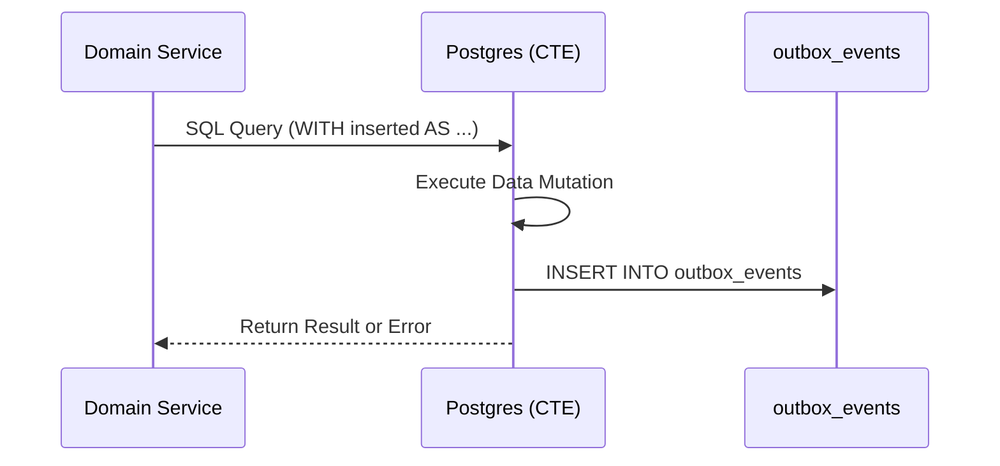
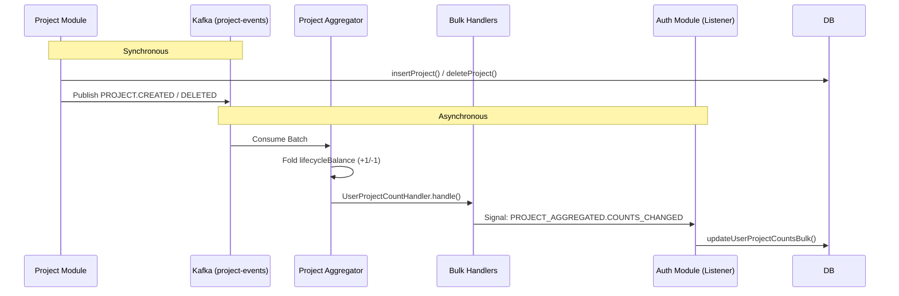
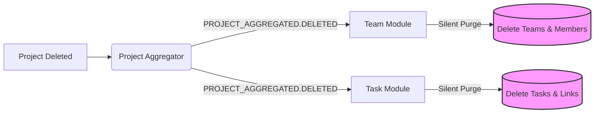
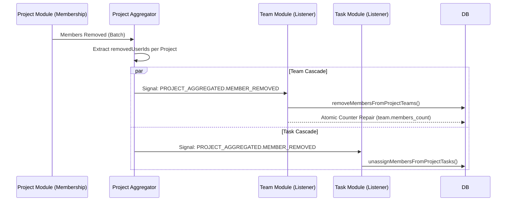
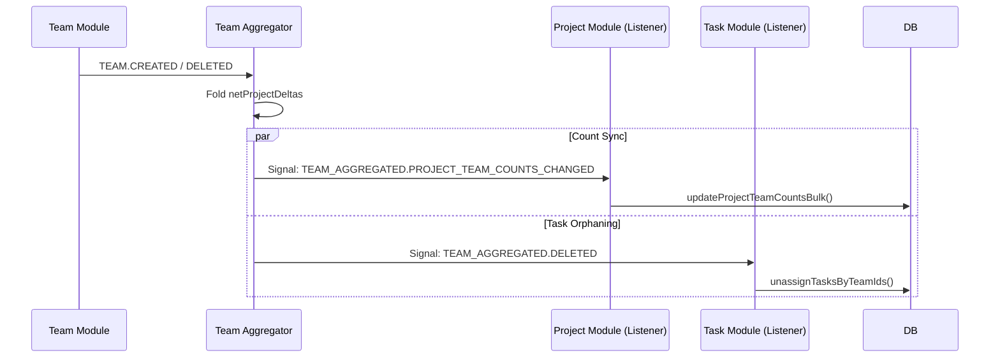
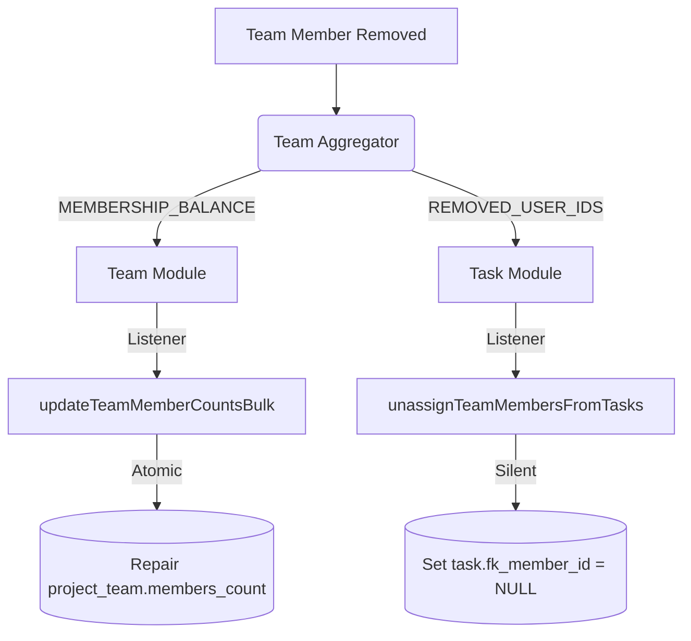

# Data Lifecycle & Event Flows

This document details the exhaustive synchronization and cascading logic of the Taskinator Monolith. It covers both the **Synchronous** (Database Transaction) and **Asynchronous** (Kafka Event Bus) flows for every primary operation.

---

## 1. Architectural Core

### The Transactional Outbox Pattern (wCTE)
To ensure that database changes and event notifications are atomic, we use a **Common Table Expression (CTE)** pattern. This guarantees that an event is written to the `outbox_events` table **only if** the primary data change succeeds.

### The Smart Batch Aggregator
All high-volume domain events (`project.*`, `team.*`) are processed by specialized **Smart Aggregators**.

1.  **Semantic Folding**: If a project is created and deleted in the same 100ms batch, the aggregator cancels both events (`+1 -1 = 0`), preventing unnecessary downstream processing.
2.  **Bulk Signaling**: Instead of one signal per event, the aggregator sends a single combined signal (e.g., "User X's project count changed by +5") to the target module.

---

## 2. Project Lifecycle Flows

### Operation: Create/Delete Project
- **Primary Table**: `project`
- **Side Effect**: Synchronizes `users.projects_count` in the **Auth** module.

### Operation: Project Deletion (Cascade Cleanup)
When a project is deleted, a "Silent Purge" happens across all associated data.

---

## 3. Project Membership Lifecycle

### Operation: Add/Remove Members
- **Primary Table**: `project_member`
- **Side Effect**: Synchronizes `project.members_count` and triggers cascading Team/Task unassignment.

---

## 4. Team Lifecycle Flows

### Operation: Create/Delete Team
- **Primary Table**: `project_team`
- **Side Effect**: Synchronizes `project.teams_count` (Project Module).

---

## 5. Team Membership Lifecycle

### Operation: Add/Remove Team Members
- **Primary Table**: `project_team_member`
- **Side Effect**: Synchronizes `project_team.members_count`.

---

## Summary of Topics & Events

| Domain | Source Topic | Aggregated Topic | Key Async Signals |
| :--- | :--- | :--- | :--- |
| **Project** | `project-events` | `project-aggregated-events` | `COUNTS_CHANGED`, `DELETED`, `MEMBER_REMOVED` |
| **Team** | `team-events` | `team-aggregated-events` | `PROJECT_TEAM_COUNTS_CHANGED`, `DELETED`, `MEMBER_REMOVED` |
| **Auth** | `auth-events` | N/A | `USER_CREATED`, `SIGNUP_STARTED` |

> [!NOTE]
> **Silent Purge Policy**
> All cascading cleanups (those triggered by aggregated `DELETED` or `MEMBER_REMOVED` signals) perform direct SQL deletions/updates that **do not** emit further Kafka events. This is a critical safeguard against recursive event loops.
