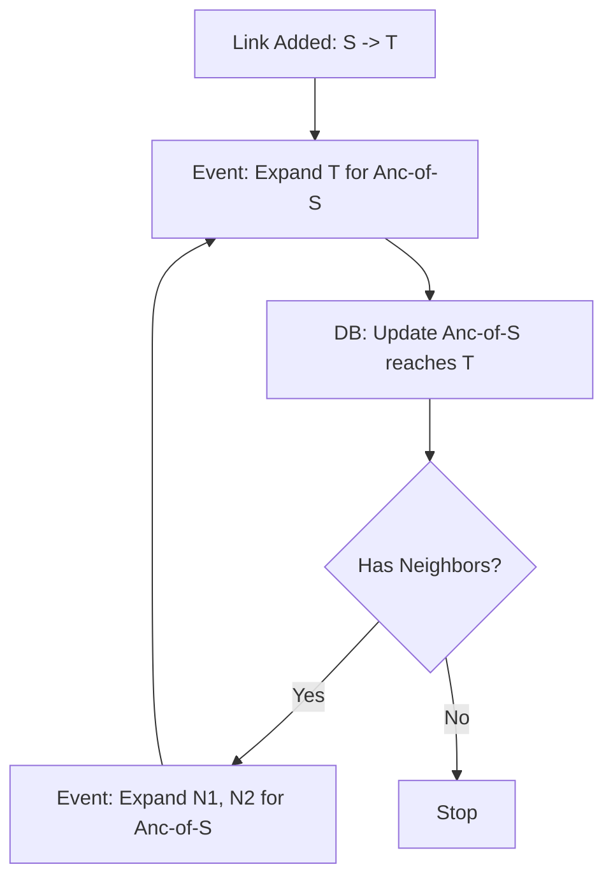

# Task Reachability Engine: Event-Recursive Frontier Expansion

This document details the architecture and logic behind the asynchronous transitive reachability engine used to maintain the `task_reachability` index.

## 1. Overview

Calculating transitive closure (who can reach whom) in a large graph is computationally expensive. Doing it synchronously during an API request blocks the user, and doing it in a single large background job can cause massive database locks.

The **Event-Recursive Frontier Expansion** strategy breaks this problem into small, manageable Kafka events. Each event represents a single "step" or "hop" in the expansion process.

### Goals
- **Non-blocking**: Each database update takes only milliseconds.
- **Scalable**: Multiple workers can process different parts of the same project simultaneously.
- **Resilient**: If a worker fails, the recursion state is preserved in Kafka.

---

## 2. The Data Model

### The `task_reachability` Table
We maintain a transitive index using an **Incremental Path Counting** approach.

| Column | Type | Description |
| :--- | :--- | :--- |
| `fk_project_id` | UUID | Project isolation boundary. |
| `ancestor_task_id` | UUID | The node that can "reach" the descendant. |
| `descendant_task_id` | UUID | The node being reached. |
| `path_count` | Integer | The number of distinct paths between these two nodes. |
| `min_depth` | Integer | The shortest path length (in hops) between A and D. |

> [!IMPORTANT]
> **Why `path_count`?**
> We track how many paths exist so that when a link `A -> B` is deleted, we only remove the reachability record `(X, Y)` if **no other path** remains between them (`path_count` drops to 0). This prevents full graph re-computation on every delete.

---

## 3. The Algorithm: Frontier Expansion

The algorithm treats link changes as "triggers" that start a cascading expansion across the graph.

### Step 0: The Initial Trigger
When a link `S -> T` is added or removed, the system identifies the "Initial Impact":
1. The **Ancestors of S** (people who can already reach S).
2. The **Target T**.

It emits an event: `REACHABILITY_EXPAND { ancestors: [Anc(S)], frontier: T, action: ADD/REMOVE }`.

### Step 1...N: Recursive Expansion
The Expansion Listener picks up the event and performs the following:

1.  **Batch Update**: For all `ancestors` in the payload, increment/decrement the `path_count` for the `frontier` node in the database.
2.  **Neighbor Discovery**: Query the `task_link` table for all immediate neighbors of the current `frontier` node.
3.  **Recursion**:
    - If neighbors exist, create a new `REACHABILITY_EXPAND` event where the `frontier` becomes the neighbors.
    - Re-publish to Kafka.
4.  **Termination**: If no new neighbors are found, the recursion for that branch stops.

### Visualization

---

## 4. Performance Optimizations

### Bulk Matrix Expansion
Instead of processing one ancestor at a time, we use a **Matrix Expand** query. If we have 50 ancestors and 10 frontier nodes, we update 500 reachability rows in **one SQL statement**.

### Kafka Partitioning
Events are keyed by `projectId`. This ensures that all reachability updates for a single project are processed in order by the same consumer, preventing race conditions within a project while allowing multi-project parallelism.

### Cycle Protection
To prevent infinite recursion in case of cycles, we maintain a `depth` counter in the event payload. If `depth > 100`, the expansion is forcibly terminated and a warning is logged.

---

## 5. Maintenance & Repair

If the `path_count` ever drifts (due to unforeseen database errors), we use a **Project Refresh** task:
1. Clear `task_reachability` for the project.
2. Run a full recursive CTE walk to re-populate the table.
3. Reset `total_incoming_count` and `total_outgoing_count` on the tasks.
