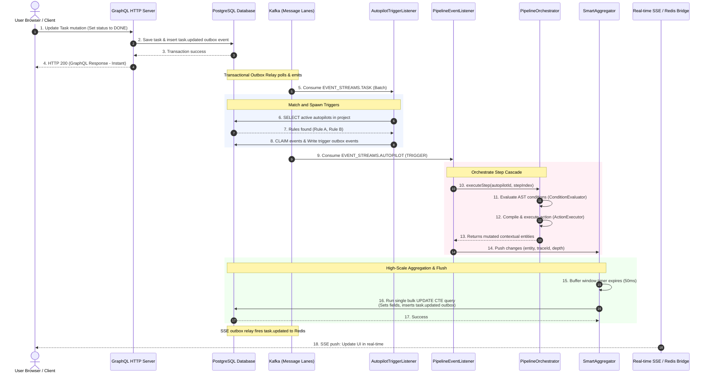

# The Autopilot Orchestrator Engine: Complete Architectural Design & Implementation Document

The **Autopilot Orchestrator Engine** is a high-throughput, low-latency, stateless event-driven automation compiler and executor designed for Taskinator. It implements asynchronous, out-of-band rule evaluation and state updates with zero database transaction block-times and strict automated loop-depth safeguards.

This document outlines the full end-to-end design, database schemas, processing pipelines, code-level execution flows, and ultra-scale optimisations required to handle the target **10,000 requests per second (RPS)** write loads on the system.

---

## 1. High-Level System Architecture & Flow

The Autopilot engine utilizes a decoupled, asynchronous, out-of-band event processing model. When a state mutation is performed (e.g., a user updates a task via the GraphQL API), the main write path completes instantly and responds to the user while rule execution is delegated to high-performance event processing pools via Kafka.

### End-to-End System Sequence Diagram



---

## 2. Core Abstract Conceptual Engine (AST Design)

At its heart, the Autopilot engine is a **stateless, AST-driven compilation engine** structured into two distinct execution branches: the **Condition Engine** and the **Action Engine**.

### 2.1 The Condition Engine (AST Predicates)
Conditions represent the `when` block of a rule. They are stored as logical AST trees supporting nested logical gates (`AND`, `OR`, `NOT`) and delta-aware field comparisons.

#### Logical Branch (`ConditionBranch`)
```json
{
  "logic": "AND | OR | NOT",
  "terms": [
    { "logic": "...", "terms": [...] },
    { "field": "status", "operator": "changedTo", "value": "DONE" }
  ]
}
```

#### Comparison Leaf (`ConditionLeaf`)
```json
{
  "field": "status",
  "operator": "eq | neq | gt | lt | gte | lte | in | contains | empty | exists | changed | changedTo | changedFrom",
  "value": "DONE"
}
```

#### Delta-Aware Evaluation (`ConditionEvaluator.ts`)
To evaluate predicates like `changedTo` or `changedFrom`, the engine constructs a dual-projection runtime payload known as the [EvaluationContext](file:///Users/kuchukboromdebbarma/Documents/projects/Taskinator-v2/modular-monolith/src/modules/autopilot/condition-engine/types.ts). This contains:
- `is`: The current, newly mutated state of the entity.
- `was`: The point-in-time snapshot of the entity *before* the mutation occurred.

The stateless [ConditionEvaluator](file:///Users/kuchukboromdebbarma/Documents/projects/Taskinator-v2/modular-monolith/src/modules/autopilot/condition-engine/ConditionEvaluator.ts) recursively parses the AST branch-by-branch, resolving operators through a modular register:
- **`eq` / `neq` / `gt` / `lt`**: Evaluated directly against the `is` projection.
- **`changed`**: Returns `true` if `was[field] !== is[field]`.
- **`changedTo`**: Returns `true` if `was[field] !== expected` AND `is[field] === expected`.
- **`changedFrom`**: Returns `true` if `was[field] === expected` AND `is[field] !== expected`.

---

### 2.2 The Action Engine (AST Execution)
Actions represent the `then` block. Each action defines the operation (`set` or `unset`), a specific field payload, and a dynamic target path.

```json
[
  {
    "target": "self | parent | children | project | team | specific",
    "operation": "set | unset",
    "field": "status",
    "value": "IN_PROGRESS"
  }
]
```

#### Lazy Projection Wrapper ([ContextualEntity](file:///Users/kuchukboromdebbarma/Documents/projects/Taskinator-v2/modular-monolith/src/modules/autopilot/action-engine/ContextualEntity.ts))
During action interpretation, target entities are not loaded upfront. Instead, they are wrapped inside a `ContextualEntity` which implements:
- **Lazy Target Resolution**: Relational parent/child targets are loaded *only if* an action explicitly targets them.
- **Dirty Field Tracking**: Tracks mutated fields in-memory (`dirtyFields: Set<string>`) to generate minimal update deltas.
- **Strict Validation Guardrails**: Restricts type casts on set operations (e.g., status must be `string`, priority must be `number`, etc.).

---

## 3. Dynamic Relational Query Resolvers

Relational lookups like `@parent` or `@children` can lead to classical N+1 database round-trips and memory execution cycles if not optimized. The Autopilot engine resolves this using a **Lazy Target Registry** combined with **Local Context Memoization**.

### 3.1 Registry Pattern ([AsyncResolverRegistry](file:///Users/kuchukboromdebbarma/Documents/projects/Taskinator-v2/modular-monolith/src/modules/autopilot/action-engine/AsyncResolverRegistry.ts))
The `AsyncResolverRegistry` exposes a pluggable resolver system. Other modules register resolution handlers matching `(sourceTable, targetPath)` combinations:

```typescript
export class AsyncResolverRegistry implements IAsyncResolverRegistry {
    private resolvers: Map<string, ResolverFn> = new Map();

    public register(sourceType: string, target: string, resolver: ResolverFn): void {
        this.resolvers.set(`${sourceType}:${target}`, resolver);
    }
}
```

### 3.2 Memoized Lookups ([ContextualEntity.resolve](file:///Users/kuchukboromdebbarma/Documents/projects/Taskinator-v2/modular-monolith/src/modules/autopilot/action-engine/ContextualEntity.ts#L55))
When `ActionExecutor` sets a field on a target, it calls `self.resolve(targetPath)`.
- If `targetPath` matches `self`, it instantly returns the current `ContextualEntity`.
- If the target was previously resolved within this specific pipeline step execution, it is retrieved from `resolvedTargets: Map<string, ContextualEntity>` cache.
- Otherwise, it invokes the registered resolver to query the database, cache the instance, and return it.

### 3.3 Default Resolvers ([defaultResolvers.ts](file:///Users/kuchukboromdebbarma/Documents/projects/Taskinator-v2/modular-monolith/src/modules/autopilot/action-engine/defaultResolvers.ts))
- **`project_task` ➡️ `parent`**: Queries the `task_link` table for incoming parent links where `label = 'parent'`, falling back to a `parent_id` column if present.
- **`project_task` ➡️ `project`**: Queries the `project` table via the task's `fk_project_id`.
- **`project_task` ➡️ `team`**: Queries `project_team` via the task's `fk_team_id`.

This lazy evaluation keeps the initial pipeline activation cost near zero while preventing duplicate database fetches within a single rule execution path.

---

## 4. High-Performance Event-Driven Flow (The Pipeline Orchestrator)

Autopilot pipelines represent sequential arrays of mixed Conditions and Actions. The processing of these steps is decoupled using Kafka message streams.

```
       [Kafka: EVENT_STREAMS.AUTOPILOT]
                     │
         Consume TRIGGER payload
                     │
          ┌──────────▼──────────┐
          │ PipelineEventListener│
          └──────────┬──────────┘
                     │
        Claims event & calls Orchestrator
                     │
       ┌─────────────▼─────────────┐
       │   PipelineOrchestrator    │
       └─────────────┬─────────────┘
                     │
         Does Loop Safety Check (depth > 50)?
                     │
       ┌─────────────▼─────────────┐
       │ Sequential Execution Loop │◄──────────────────────┐
       └─────────────┬─────────────┘                       │
                     │                                     │
           Is Condition Step?                              │
          ┌──────────┴──────────┐                          │
          ▼                     ▼                          │
     [Evaluate AST]       [Halt Execution]                 │
     (If Passed)          (If Failed)                      │
          │                                                │
          ▼                                                │
      Is Action Step?                                      │
          │                                                │
          ▼                                                │
     [Compile & Execute]                                   │
     (Mutates ContextualEntity)                            │
          │                                                │
          ▼                                                │
     Pushes updates to SmartAggregator                     │
          │                                                │
          └────────────────────────────────────────────────┘ (Increment stepIndex)
```

### 4.1 Sequential Step Execution & Halt Semantics
The [PipelineOrchestrator](file:///Users/kuchukboromdebbarma/Documents/projects/Taskinator-v2/modular-monolith/src/modules/autopilot/orchestrator/PipelineOrchestrator.ts) processes steps in strict order:
1.  **Rule Fetching**: Retrieves the active rule steps by `autopilotId`.
2.  **Halt Gate (Conditions)**: If step matches `type: 'condition'`, it builds the runtime context and evaluates it. If the condition fails, the pipeline executes a **hard halt**, logging the natural language failure and returning `HALTED` immediately. No subsequent actions or conditions are processed.
3.  **Mutation Collection (Actions)**: If step matches `type: 'action'`, the engine executes the mutations in-memory on the loaded `ContextualEntity`. The mutated entities are returned in the `StepResult`.

### 4.2 Kafka-Driven Resume Loops
If a pipeline contains multiple action sets, the engine splits execution into sequential Kafka-driven continuation bounds to maintain small, predictable message frames:
- **`PIPELINE.TRIGGER`**: Dispatched to launch the execution chain from step 0.
- **`PIPELINE.CONTINUE`**: If the orchestrator finishes a step and a subsequent step exists, it appends a `PIPELINE.CONTINUE` event containing `{ autopilotId, state: { traceId, stepIndex: nextIndex, depth } }` into the outbox. When the event consumer processes the continuation message, it resumes execution precisely from that index, maintaining exact sequential ordering without locking process resources.

---

## 5. Ultra-Scale Optimisations (10k RPS target)

Under high write stress (10,000 requests per second), naive event loops can quickly lead to database thread starvation, transaction lock-wait timeout spikes, and high memory leaks. The Autopilot engine employs three critical scaling patterns to survive massive traffic:

### 5.1 Micro-Transaction Isolation (Decoupled Scoping)
In high-throughput systems, holding transactions open while performing external work is the number one cause of connection pool starvation.
- **The Old Pattern**: The event listener wrapped the entire rule evaluation and action mutation chain in an outer `db.transaction()` block, holding a database connection open during the entire CPU-heavy step compilation, relational resolution, and update processes.
- **The Optimized Pattern**: We shrank transaction scopes strictly to micro-second boundaries. A short transaction is opened *only* to claim Kafka events atomically inside `claimEventsAtomic` and insert idempotency tokens. The rest of the orchestrator loop, condition checks, and target resolver database reads are run outside the transaction scope using the global connection pool. Connections are checked back into the pool instantly, keeping thread utilization near zero.

### 5.2 Smart Buffer Aggregation ([SmartAggregator](file:///Users/kuchukboromdebbarma/Documents/projects/Taskinator-v2/modular-monolith/src/modules/autopilot/orchestrator/SmartAggregator.ts))
Rather than firing individual database `UPDATE` statements for every action mutation (which causes severe disk write bottlenecks), mutations are aggregated in-memory:
- **In-Memory Buffering**: Pushed mutations are buffered in a map: `buffer: Map<EntityType, Map<EntityId, AggregationItem>>`.
- **Field Merging**: If the same task is mutated multiple times by different steps or parallel triggers, their field changes are merged together in-memory.
- **Windowed Flush**: A timer flushes buffers every **50ms**, or instantly if a batch hits **500 items**.
- **High-Reliability Rollback**: If a database flush fails, the aggregator catches the error, restores the items, and merges them back into the active buffer to retry on the next cycle, ensuring absolute zero data loss.

### 5.3 CTE Transactional Outbox Writes ([SmartAggregator.executeBulkUpdate](file:///Users/kuchukboromdebbarma/Documents/projects/Taskinator-v2/modular-monolith/src/modules/autopilot/orchestrator/SmartAggregator.ts#L224))
When flushing updates to tasks, the aggregator must notify the rest of Taskinator (to recalculate denormalized counts, index search documents, and bridge real-time SSE UI updates) by inserting a `task.updated` event into the transactional `outbox_events` table.

To achieve this in exactly **one database round-trip**, we compile a single PostgreSQL CTE query:
1.  **`old_state` CTE**: Selects old fields (`fk_team_id`, `fk_member_id`, `title`, `status`) of all task IDs being updated.
2.  **`updated_task` CTE**: Executes a bulk `UPDATE` using SQL `CASE` statements to apply unique changes to different rows in one statement, returning the newly updated values.
3.  **`inserted_outbox` Insert**: Performed in the same query by joining `updated_task` and `old_state` CTEs, building a fully populated `task.updated` payload carrying old state, new state, correlation `traceId`, and loop `depth` parameters!

```sql
WITH old_state AS (
    SELECT id, fk_team_id, fk_member_id, title, status 
    FROM project_task 
    WHERE id IN ($1::uuid, $2::uuid)
),
updated_task AS (
    UPDATE project_task
    SET 
        "status" = CASE id 
            WHEN $3::uuid THEN $4 
            ELSE "status" END,
        "priority" = CASE id 
            WHEN $5::uuid THEN $6 
            ELSE "priority" END
    WHERE id IN ($7::uuid, $8::uuid)
    RETURNING id, fk_project_id, fk_team_id, fk_member_id, title, status
)
INSERT INTO outbox_events (stream, stream_key, payload)
SELECT 
    'task-events',
    u.fk_project_id::text,
    jsonb_build_object(
        'type', 'task.updated',
        'taskId', u.id,
        'projectId', u.fk_project_id,
        'old', jsonb_build_object(
            'teamId', o.fk_team_id,
            'memberId', o.fk_member_id,
            'title', o.title,
            'status', o.status
        ),
        'new', jsonb_build_object(
            'teamId', u.fk_team_id,
            'memberId', u.fk_member_id,
            'title', u.title,
            'status', u.status
        ),
        'actorId', 'system:autopilot',
        'traceId', CASE id WHEN $9::uuid THEN $10 WHEN $11::uuid THEN $12 END,
        'depth', CASE id WHEN $13::uuid THEN $14::integer WHEN $15::uuid THEN $16::integer END
    )
FROM updated_task u
JOIN old_state o ON u.id = o.id
```
This is a masterpiece of database query scaling:
- No N+1 reads or duplicate SELECT statements.
- Atomic updates of hundreds of tasks in a single disk flush.
- Outbox events are guaranteed to be transactionally consistent with the mutations.

---

## 6. Cascade Loop Safety & Asynchronous Depth Guards

Infinite loops represent a catastrophic risk for any event-driven automation platform (e.g., Rule A sets task status to DONE ➡️ fires `task.updated` ➡️ triggers Rule B which sets status to TODO ➡️ fires `task.updated` ➡️ triggers Rule A again, repeating forever).

To guard against loop crashes, the Autopilot engine implements a **Trace-Level Depth Cascade Guard** that spans asynchronous Kafka boundaries:

```
    SmartAggregator (CTE)
              │
    Sets 'actorId' to 'system:autopilot'
    & includes current 'depth' in outbox payload
              │
              ▼
    Published to Kafka: EVENT_STREAMS.TASK
              │
              ▼
    [AutopilotTriggerListener.ts]
    Consumes task event from Kafka
              │
    Is 'actorId' equal to 'system:autopilot'?
         ├── YES ➡️ Mark isRecursiveTrigger: true & set depth = payload.depth
         └── NO  ➡️ Mark isRecursiveTrigger: false & set depth = 0
              │
              ▼
    Inserts PIPELINE.TRIGGER outbox event with (isRecursiveTrigger, depth)
              │
              ▼
    [PipelineEventListener.ts]
    Consumes TRIGGER event
              │
    Is 'isRecursiveTrigger' true?
         ├── YES ➡️ Increment state.depth = parentDepth + 1
         └── NO  ➡️ Set state.depth = 0
              │
              ▼
    Calls PipelineOrchestrator.executePipeline()
              │
              ▼
    [PipelineOrchestrator.checkLoopSafety()]
    Is depth > 50?
         ├── YES ➡️ THROW LOOP DETECTED ERROR (Halt & Log cascade chain!)
         └── NO  ➡️ Proceed to execute steps safely
```

### 6.1 Loop Detection Threshold
If the recursion chain depth exceeds **50 hops**, `PipelineOrchestrator.checkLoopSafety()` instantly throws a loop detection error. The orchestrator catches the error, halts execution, and logs the complete cascade path along with the `traceId` to the diagnostics console. This prevents infinite cycles from ever exhausting CPU or storage.
