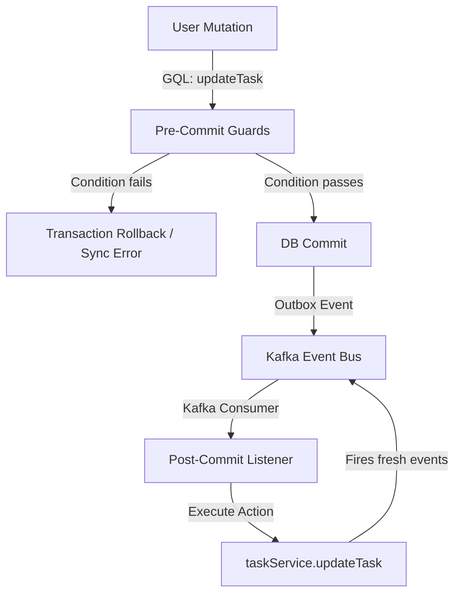

# Taskinator Roadmap: Next-Gen Server-Driven Declarative Automation Engine

This document details the architectural design, database schemas, and implementation plan for the **Declarative Trigger-Condition-Action (TCA) Automation Engine**. 

---

## 🎯 Architecture Philosophy: Simple, Flexible, & Non-Rigid

To avoid the maintenance traps of complex interpreters, visual AST graph builders, or rigid hardcoded rules, this system is designed on three pillars:
1. **Enum-Driven Code Registry**: Triggers, conditions, and actions are registered as finite, strongly typed Enums in TypeScript.
2. **Flat Relational Database Schema**: Automation rules are stored in a simple, flat table with generic string parameters.
3. **Server-Driven UI Templates**: The backend defines form fields and option sources dynamically. The frontend React app is "dumb"—it fetches templates from the backend and renders inputs on the fly.

---

## 📍 Step 1: Flat Database Schema

Instead of nested JSON trees or expression trees, rules are stored as standard relational rows with flat parameter columns:

```sql
CREATE TABLE task_automation_rule (
    id UUID PRIMARY KEY DEFAULT uuid_generate_v4(),
    fk_project_id UUID NOT NULL REFERENCES project(id) ON DELETE CASCADE,
    name TEXT NOT NULL DEFAULT 'Untitled Automation',
    is_active BOOLEAN NOT NULL DEFAULT TRUE,
    
    -- Trigger ("When Y happens")
    trigger_type TEXT NOT NULL,
    trigger_value TEXT,
    
    -- Condition ("If Z is met")
    condition_type TEXT NOT NULL,
    condition_value TEXT,
    
    -- Action ("Do X")
    action_type TEXT NOT NULL,
    action_value TEXT,
    
    version INTEGER NOT NULL DEFAULT 1,
    created_at TIMESTAMP WITH TIME ZONE DEFAULT CURRENT_TIMESTAMP,
    updated_at TIMESTAMP WITH TIME ZONE DEFAULT CURRENT_TIMESTAMP
);

CREATE INDEX idx_automation_project_trigger ON task_automation_rule(fk_project_id, trigger_type);
```

---

## 📍 Step 2: The Supported Registry

### 1. Triggers (The "When")
* `STATUS_CHANGED` (Value: JSON string with optional `from` and `to` status constraints) - Fires when a task changes status.

### 2. Conditions (The "If")
* `STATUS_EQUALS` (Value: Status string) - Checks if the task's current status matches the value.
* `ASSIGNEE_EQUALS` (Value: User ID or `'none'`) - Checks if the task's assignee matches the value.

### 3. Actions (The "Then")
* `SET_STATUS` (Value: Target Status string)
* `SET_ASSIGNEE` (Value: User ID, `'actor'`, or `'none'`)
* `REJECT_TRANSITION` (Value: Error message string) - Synchronously rejects the status transition and displays a warning banner.

---

## 📍 Step 3: Dual-Path Execution Model

To support both **validation constraints (blocking)** and **event-driven cascades (non-blocking)**, the engine operates on a dual-path lifecycle:



### A. Synchronous & Blocking (Pre-Commit Guards)
Executed inside the **request-response database transaction** of `TaskService.updateTask`. 
* **Use Case**: Blocking transitions if blockers are incomplete (`REJECT_TRANSITION`).
* **Implementation**: Inside `updateTask`, before committing the transaction, the service queries all active `Sync` rules matching the trigger. If a condition evaluates to true, the action throws a `ValidationError`, rolling back the Postgres transaction cleanly.

### B. Asynchronous & Non-Blocking (Post-Commit Cascades)
Executed as **Background Event Listeners** listening to standard Kafka/Outbox events.
* **Use Case**: Automatically unlocking a dependent task (`SET_STATUS` to `READY`) when prerequisites are completed.
* **Event Loop Protection**: All background actions **MUST invoke the standard `taskService.updateTask` method**. This guarantees:
  1. Task versions increment correctly.
  2. Standard `task.updated` outbox events are generated.
  3. Transitive `task_reachability` closures and aggregations sync perfectly.
  4. Realtime subscription streams propagate the changes cleanly to all frontends.

---

## 📍 Step 4: Server-Driven Metadata Form Templates

To allow adding or modifying automations entirely from the backend without rebuilding the React UI, the backend exposes the form specification schema dynamically.

### 1. GraphQL Interface

```graphql
enum InputType {
  SELECT
  TEXT
  NUMBER
  NONE
}

type AutomationOption {
  value: String!
  label: String!
}

type ValueTemplate {
  inputType: InputType!
  label: String!
  placeholder: String
  staticOptions: [AutomationOption!]
  dynamicOptionsSource: String # E.g. 'PROJECT_STATUSES', 'PROJECT_MEMBERS'
}

type TriggerTemplate {
  type: String!
  label: String!
  description: String!
  valueTemplate: ValueTemplate!
}

type ConditionTemplate {
  type: String!
  label: String!
  description: String!
  valueTemplate: ValueTemplate!
}

type ActionTemplate {
  type: String!
  label: String!
  description: String!
  valueTemplate: ValueTemplate!
}

type AutomationTemplatesCatalog {
  triggers: [TriggerTemplate!]!
  conditions: [ConditionTemplate!]!
  actions: [ActionTemplate!]!
}

extend type Query {
  automationTemplatesCatalog(projectId: ID!): AutomationTemplatesCatalog!
}
```

### 2. Example Backend Catalog Payload
When queried, the server describes exactly what inputs the frontend React application must draw:

```json
{
  "triggers": [
    {
      "type": "TASK_STATUS_CHANGED",
      "label": "When task status changes to",
      "description": "Fires when a task transitions to a target status column.",
      "valueTemplate": {
        "inputType": "SELECT",
        "label": "Select Status",
        "dynamicOptionsSource": "PROJECT_STATUSES"
      }
    }
  ],
  "actions": [
    {
      "type": "REJECT_TRANSITION",
      "label": "Reject the status transition",
      "description": "Synchronously blocks the status transition and displays a message.",
      "valueTemplate": {
        "inputType": "TEXT",
        "label": "Rejection Message",
        "placeholder": "You cannot start this task yet!"
      }
    }
  ]
}
```

### 3. Dumb UI Form Rendering
In `ui-v1`, instead of writing custom forms, the builder fetches the catalog and loops over the `valueTemplate` fields to render standard generic components dynamically:

* `inputType === 'TEXT'` ➔ `<TextField label={template.label} />`
* `inputType === 'SELECT' && dynamicOptionsSource === 'PROJECT_STATUSES'` ➔ Fetches status columns for that project and populates a `<Select />` dropdown.
* `inputType === 'NONE'` ➔ Renders no additional fields.
