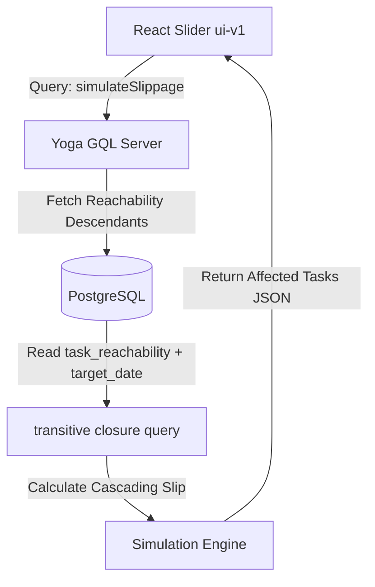

# Taskinator Roadmap: Next-Generation Graph-Powered PM Features

This roadmap outlines the design, architecture, and implementation plan for two groundbreaking project management features that leverage Taskinator’s core competitive advantage: its **high-performance transitive reachability graph engine (`task_reachability`)**.

---

## 🚀 Vision: Turning Graph Theory into Intuitive PM Risk Assessment

Most project management platforms (e.g., Linear, Jira, Asana) treat dependencies as static fields. They do not understand the cumulative impact of delays across an entire graph of tasks. 

By utilizing Taskinator’s recursive transitive closure tables, we can calculate cascading impacts instantly at database speeds. Our roadmap introduces:
1. **The "Slippage Blast Radius" Simulator**: Instant forecasting of how a schedule slip on any task propagates downstream to affect deadlines.
2. **Blast Radius & Bottleneck Analytics**: Algorithmic hotspot discovery using graph centrality metrics calculated from transitive blocker counters.

---

## 📍 Phase 1: The "Slippage Blast Radius" Simulator

### 1. Functional Specification
The **Slippage Blast Radius Simulator** allows developers and project managers to ask: *"If this task slips by N days, what is the exact cascading impact on all downstream deliverables?"*

* **Interactive Simulator Slider**: Users can drag a slippage slider (e.g., `+3 days`, `+1 week`) on any task details view.
* **Cascading Heat Map**: Instantly colors downstream tasks on the dependency graph and board based on their risk profile:
  * <span style="color:#ef4444; font-weight:bold;">High Risk (Red)</span>: Slippage violates the task’s own target date or the project’s main launch milestone.
  * <span style="color:#f59e0b; font-weight:bold;">Medium Risk (Orange)</span>: Slippage consumes more than 80% of the task's schedule buffer.
  * <span style="color:#10b981; font-weight:bold;">Low Risk (Green)</span>: Downstream task has enough buffer to absorb the delay.
* **Milestone Slip Alerts**: Displays a prominent header notification if the simulated delay pushes the final delivery milestone past the contractual launch date.

---

### 2. Proposed Technical Architecture



#### A. Backend GraphQL Interface
We will add a new simulation query to the task schema:

```graphql
type SimulatedSlip {
  taskId: ID!
  title: String!
  originalTargetDate: String!
  simulatedTargetDate: String!
  slipDays: Int!
  riskLevel: RiskLevel!
  bufferRemainingDays: Int!
}

enum RiskLevel {
  LOW
  MEDIUM
  HIGH
}

extend type Query {
  simulateSlippage(
    projectId: ID!
    taskId: ID!
    delayDays: Int!
  ): [SimulatedSlip!]!
}
```

#### B. Database & Query Engine
The simulation runs at O(1) database speeds by leveraging `task_reachability` to pull all downstream descendants of `taskId` inside a single query:

```sql
SELECT 
  pt.id,
  pt.title,
  pt.target_date,
  tr.descendant_task_id,
  -- Calculate recursive path length or depth to model sequential vs parallel delays
  MAX(tr.depth) as path_length
FROM task_reachability tr
JOIN project_task pt ON pt.id = tr.descendant_task_id
WHERE tr.ancestor_task_id = :taskId
GROUP BY pt.id, pt.title, pt.target_date, tr.descendant_task_id;
```
The **Simulation Engine** then traverses the returned downstream tasks sequentially to determine the cascading slippage, comparing it with their respective target dates to label the `RiskLevel`.

---

## 📍 Phase 2: Blast Radius & Bottleneck Analytics

### 1. Functional Specification
Instead of relying on subjective "Priority" flags (Low/Medium/High) set by users, this feature provides **Algorithmic Blocker Analytics** based on actual dependency graph density.

* **Impact Quotient / Blast Radius Score**: Automatically calculates a score for each task representing how much of the project it blocks:
  $$\text{Blast Radius} = \text{total\_outgoing\_count}$$
  If a task with a Blast Radius of 45 is blocked, it means 45 other tasks across the organization are completely stalled.
* **Dependency Depth Score**: Identifies tasks that have a massive chain of prerequisites:
  $$\text{Dependency Depth} = \text{total\_incoming\_count}$$
  High depth tasks are "late-stage" deliverables that are highly vulnerable to upstream delays.
* **Bottleneck Radar Dashboard**: A manager-focused view showcasing:
  * **Critical Path**: Highlighted chain of tasks that represents the absolute minimum timeline of the project.
  * **Deadlock Risk Warnings**: Highlights task groups that are dangerously close to creating complex cyclic dependencies (which the engine actively rejects, keeping the graph clean).

---

### 2. Proposed Technical Architecture

We will expose these metrics via GraphQL on the standard `ProjectTask` type, utilizing the columns updated dynamically by the reachability engine:

```graphql
extend type ProjectTask {
  """
  The number of tasks directly or transitively blocked by this task.
  Computed dynamically from task_reachability.
  """
  blastRadius: Int!

  """
  The number of prerequisite tasks this task depends on.
  Computed dynamically from task_reachability.
  """
  dependencyDepth: Int!

  """
  Determines if this task lies on the project's critical path.
  """
  isOnCriticalPath: Boolean!
}
```

#### Database Columns Utilized
This feature directly leverages the columnar indexes that the Taskinator reachability engine already synchronizes inside `project_task`:
* `total_incoming_count` -> maps to `dependencyDepth`
* `total_outgoing_count` -> maps to `blastRadius`

This allows the **Bottleneck Dashboard** to query and rank tasks instantly without needing to compute complex recursive closures on every page load:

```sql
-- Fetch the top 5 critical bottlenecks in the project
SELECT id, title, total_outgoing_count AS blast_radius 
FROM project_task 
WHERE fk_project_id = :projectId AND status != 'DONE'
ORDER BY total_outgoing_count DESC
LIMIT 5;
```

---

## 📈 Impact on the Taskinator Platform
By adding these two features, Taskinator-v2 stops being "just another Kanban board" and becomes a **highly sophisticated project steering intelligence engine**. It turns the technical complexity of your recursive PostgreSQL engine into an immediate, high-value product selling point that managers will love.
