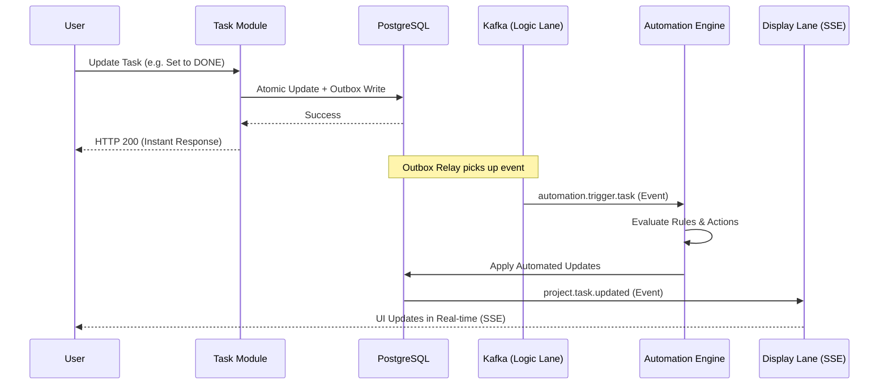

# Execution Flow & Implementation Details

This document provides a tiered deep-dive into how the Automation Engine operates, from the high-level event-driven lifecycle down to the specific code-level components.

---

## 1. High-Level Lifecycle (The "Bird's Eye" View)

The Automation Engine is a background system that reacts to state changes. It follows a decoupled, asynchronous path to ensure that user mutations are never delayed by complex rule evaluations.

---

## 2. Low-Level Mechanics (The "Infrastructure" Layer)

To achieve high throughput (10k RPS target) and system stability, the engine employs several sophisticated infrastructure patterns.

### Dual-Lane Outbox Strategy
Every automated update generates two distinct types of Kafka events within the same database transaction:
1.  **Display Lane (`project.task.updated`)**: Minimal payload. Used exclusively for real-time UI synchronization. Carries the `correlationId` for traceability.
2.  **Logic Lane (`automation.trigger.task`)**: Fat payload. Contains `oldState` and `newState` snapshots. Used to trigger further automations.

### Batched Listener Windowing
The `AutomationListener` does not process events one-by-one. It uses a **Windowing strategy**:
- **Window**: 50ms or 100 events (whichever comes first).
- **Efficiency**: Resolves all rules for the entire batch in exactly **3 DB queries** (Task, Team, and Project scoped rules), regardless of batch size.

### Concurrency & Stability
Processes the batch in **throttled chunks of 10 parallel items**. This prevents a sudden burst of 100 concurrent rule evaluations from exhausting the database connection pool.

### Traceability (Correlation)
A `correlationId` (UUID) is generated at the very start of a chain (the user's mutation). This ID is propagated through every Kafka event and automated update, allowing logs and traces to stitch together a complex multi-hop automation cascade.

---

## 3. Code-Level Implementation (The "Component" Layer)

The engine is modularized into discrete, single-responsibility components within `src/modules/automation/internal/engine/`.

### `AutomationListener.ts` (The Coordinator)
The entry point. It manages the internal batch buffer, triggers rule fetching, and orchestrates the parallel execution of the `ActionDispatcher`.

### `ConditionEvaluator.ts` (The Logic)
A pure function that implements recursive evaluation of `RuleGroups`.
- **Stateless**: Does not touch the database.
- **Recursive**: Handles nested `OR`/`AND` logic.
- **Delta-Aware**: Can compare `oldState` vs `newState` for operators like `CHANGED_TO`.

### `TargetResolver.ts` (The Router)
Resolves relational directions (`@parent`, `@children`, `@descendants`) into concrete UUIDs.
- **Memoization**: Uses a `LocalTargetCache` (Map) to ensure that if multiple rules/actions in the same chain target `@children`, the DB query is only executed once.

### `ActionDispatcher.ts` (The Executor)
The sequential orchestrator for a single trigger.
- **Order Guarantee**: Executes actions in the exact order defined by the user.
- **Depth Safety**: Hard-stops at `MAX_CASCADE_DEPTH = 5` to prevent infinite loops.

### `AutomationQueries.ts` (The Mutation Engine)
Contains `automationBulkUpdateTasks`. This is a "trusted" internal query that performs the final task mutations and handles the atomic Dual-Lane outbox emission.

---

> [!TIP]
> **Performance Note**
> Because relational targets are resolved using the **Materialized Path** index or the `fk_parent_task_id` index, even deep `@descendants` updates are extremely efficient O(log N) operations.
