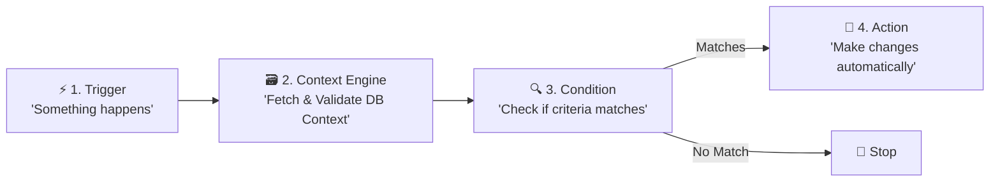

# Scoped Automation Engine (`auto-action` Module)

Welcome to the **Scoped Automation Engine** (`auto-action` module)! This module is a powerful, high-performance, and loosely coupled event-driven automation framework. It allows users, integrators, and developers to define and execute automated rules that keep their workspaces organized, synchronized, and highly productive without requiring manual intervention.

---

## 🌟 What is the `auto-action` Module?

At its core, the `auto-action` module is responsible for **automating workflows** within specific entity scopes (currently focused on `TASK`). 

Imagine a user wanting to enforce rules like:
* *"When a task's status changes to `IN_PROGRESS`, set its priority to `High` and assign it to the Engineering team."*
* *"When a task is updated and its priority is elevated, automatically add a description template."*

The `auto-action` module makes this possible by receiving events, evaluating nested logical rules, and executing corresponding changes safely, rapidly, and concurrently.

---

## 🧭 How Everything Works: A User's Perspective

To understand the engine, it helps to look at the four foundational concepts that make up any automation rule: **Triggers**, **Context Engine**, **Conditions**, and **Actions**. Together, they form the **Rule Lifecycle**:



### ⚡ 1. Triggers
A **Trigger** is the event or "hook" that kicks off the automation process. It represents something happening in the workspace.
* **Task Created (`task.created`)**: Fires immediately when a new task is created.
* **Task Updated (`task.updated`)**: Fires whenever any field, team, or assignee changes on an existing task.

### 🗃️ 2. Context Engine
The **Context Engine** is the centralized, extensible system responsible for building a unified, type-safe state snapshot representing the target entity at the time of the event. It acts as the single source of truth that feeds conditions and actions:
* **Live-Fetch Database Resolvers**: Resolves fresh, up-to-date values directly from the database columns (e.g. `title`, `status`, `version` from `project_task`).
* **Snapshot State Merging**: Gracefully overlays the incoming event's previous state snapshot (the `was` state) onto the database current state (the `is` state), producing standardized pairs like `prev_status` and `current_status`.
* **Runtime Schema Verification**: Leverages scope-specific Zod schemas (such as `taskContextSchema`) to guarantee 100% data contract safety before any downstream component evaluates it.

### 🔍 3. Conditions
A **Condition** is the logical filter that determines whether the action should actually run. Conditions can be combined to build simple or highly complex filters using logic blocks:
* **`AND`**: All nested conditions must be true.
* **`OR`**: At least one nested condition must be true.
* **`NOT`**: The nested condition must not be true.

Inside these blocks, you define the actual field checks. Unlike rigid static filters, this engine is optimized for **transitions** (detecting changes between the "before" and "after" states):
* **`TaskFieldChanged`**: Detects if a field (like `status` or `priority`) was modified.
* **`TaskFieldChangedTo`**: Detects when a field transition matches a specific target (e.g., status changes to `IN_PROGRESS`).
* **`TaskFieldChangedFrom`**: Detects when a field changes away from a starting value.
* **`TaskFieldChangedFromTo`**: Checks if a field transitioned from a specific old value to a specific new value.
* **`TaskTeamAssigned` / `TaskMemberAssigned`**: Detects assignment of teams or members.
* **`TaskTeamUnassigned` / `TaskMemberUnassigned`**: Detects when a team or member is unassigned.

### 🚀 4. Actions
An **Action** is the operation executed automatically when all conditions are satisfied.
* **Set Fields (`SetFields`)**: Updates standard fields (such as `status`, `priority`, `title`, or `description`), assigns/unassigns teams, or modifies assigned members.
  > [!NOTE]
  > **Cascading Behavior**: Setting or changing a task's assignee to a team or member respects natural cascade rules. For example, unassigning a team will automatically unassign any members of that team from the task to keep the data clean.

---

## 🛠️ Concrete Examples: Automation Rule Payloads

Below are example configurations demonstrating how rules are represented as JSON payloads in the system.

### Example A: Status Transition & Assignment Rule
**Rule Description:** *When a task's status changes to `IN_PROGRESS`, set the priority to `3` (Medium) and assign it to `team-456`.*

```json
{
  "trigger": "task.updated",
  "condition": {
    "type": "TaskFieldChangedTo",
    "field": "status",
    "to": "IN_PROGRESS"
  },
  "action": {
    "type": "SetFields",
    "config": {
      "priority": 3,
      "teamId": "team-456"
    }
  }
}
```

### Example B: Multi-Condition Logical Rule
**Rule Description:** *When a task's priority is increased to `5` (Critical) AND it is assigned to `team-123`, BUT it is not yet set to `DONE`.*

```json
{
  "trigger": "task.updated",
  "condition": {
    "type": "logical",
    "operator": "AND",
    "children": [
      {
        "type": "TaskFieldChangedTo",
        "field": "priority",
        "to": 5
      },
      {
        "type": "TaskTeamAssigned",
        "teamId": "team-123"
      },
      {
        "type": "logical",
        "operator": "NOT",
        "children": [
          {
            "type": "TaskFieldChangedTo",
            "field": "status",
            "to": "DONE"
          }
        ]
      }
    ]
  },
  "action": {
    "type": "SetFields",
    "config": {
      "description": "[CRITICAL AUTOMATION] Priority raised to 5. Please triage immediately."
    }
  }
}
```

---

## 📁 Module Directory Structure

```
src/modules/auto-action/
├── README.md                    # User-facing guide (this file)
├── index.ts                     # Root module entrypoint, bootstrappers, and autoActionService singleton
├── AutoActionService.ts         # Public service interface (CRUD + OCC contract)
├── types.ts                     # Scope-agnostic AST and core registry types
├── contextEngine.ts             # Isolated ContextResolverRegistry and fetchContext()
├── actionEngine.ts              # Isolated ActionExecutorRegistry and executeAction()
├── conditionEngine.ts           # ConditionRegistry, evaluateCondition() & evaluateConditionFromIndex()
├── internal/                    # Private service layer (not exported beyond this module)
│   ├── AutoActionQueries.ts     # Raw Kysely DB functions (insert, select, update, delete)
│   └── AutoActionServiceImpl.ts # Business logic: OCC, name-uniqueness, pipeline validation
├── auto-action-engine/          # Central orchestration subsystems
│   ├── index.ts                 # Sub-module exports
│   ├── types.ts                 # PipelineStep schemas, isFlowSyncSafe(), isConditionAsync()
│   ├── executor.ts              # executeAutoActionStep(), executeAutoActionPipeline(), StepResumeCursor
│   └── template.ts              # Dynamic Zod-to-JSON-Schema converter and scope catalog
├── scopes/
│   └── task/                    # Scoped implementations isolated for TASK
│       ├── index.ts             # Task scope bridge and bootstrappers
│       ├── types.ts             # TaskContext & TaskPredicate leaf Zod schemas
│       ├── context.ts           # TASK scope resolver — uses taskService.getTaskContextById()
│       ├── conditions.ts        # Task predicate evaluator bridge
│       ├── conditions/          # Modular split of individual task leaf conditions
│       └── actions/
│           └── setFields.ts     # Task field action — delegates to taskService.updateTask()
└── docs/                        # Internal implementation and architecture guides
    ├── architecture.md
    ├── orchestration.md         # Pipeline execution, condition splitting, prev_ columns
    ├── context.md               # Context engine, DB-first prev_ priority chain
    ├── conditions.md
    ├── actions.md
    ├── registry.md
    └── triggers.md
```

---

## 📖 Deep-Dive Developer Documentation

If you are a developer extending the engine, building new actions/conditions, or auditing the performance and scaling guarantees, please read our comprehensive internal documentation guides:

### ⚡ [1. High-Performance Architecture](docs/architecture.md)
* **Pure Stateless Evaluations**: Why evaluations take `<1ms` and run with zero database roundtrips.
* **Fresh-Fetch Pattern**: How actions read the latest database state before committing updates to prevent stale mutations.
* **Optimistic Concurrency Control**: How the system utilizes the `version` column to handle 10k+ RPS concurrent modifications safely via `ConcurrentUpdateException`.

### 🗃️ [2. Context Engine & Resolvers](docs/context.md)
* **Decoupled Database Resolvers**: How scope resolvers retrieve, normalize, and construct state snapshots.
* **Snapshot State Merging**: Rules mapping incoming event payloads onto DB columns (`prev_` and `current_` properties).
* **Zod Data Verification**: Ensuring 100% type safety and runtime checks.

### 🎛️ [3. Triggers & Event Hooks](docs/triggers.md)
* **Dynamic Trigger Registration**: Bootstrapping hook types.

### 🔍 [4. Condition AST & Evaluation](docs/conditions.md)
* **AST Logical Nodes**: Recursive `AND`, `OR`, and `NOT` compilation with Zod's `z.lazy()`.
* **Modular Predicates**: The modular design split of individual leaf conditions and shared extraction helpers.

### 🚀 [5. Action Executors & Lifecycle](docs/actions.md)
* **Action Registration**: Schema requirements and input Zod shapes.
* **Execution Flow**: Step-by-step transaction walkthrough, cascading assignment calculations, and lock-checking updates.

### 🔁 [7. Orchestration, Pipeline & Condition Splitting](docs/orchestration.md)
* **Pipeline Execution**: How `executeAutoActionPipeline` sequences steps and fetches fresh context at every iteration.
* **Persistent `prev_` Columns**: How previous field values are stored atomically in `project_task` so every pipeline step reads consistent transition state regardless of concurrency.
* **Condition Splitting**: How `StepResumeCursor` and `evaluateConditionFromIndex` allow very long `AND` condition trees to be split across future batch/async boundaries.
* **Suspendable Execution**: How `startIndex` + `startCursor` enable exact mid-pipeline and mid-condition resumption.
* **Extension Points**: The precise swap points for plugging in future async processing (Kafka/Outbox, queued dispatchers, new scopes).

---

## 🧪 Verification & Testing

To run the complete automated test suite covering context resolution, condition evaluation, pipeline execution, and condition splitting:
```bash
bun test src/modules/auto-action/__tests__/
```

To run individual suites:
```bash
bun test src/modules/auto-action/__tests__/contextEngine.test.ts
bun test src/modules/auto-action/__tests__/autoActionEngine.test.ts
```

To typecheck the module:
```bash
bun x tsc --noEmit
```
