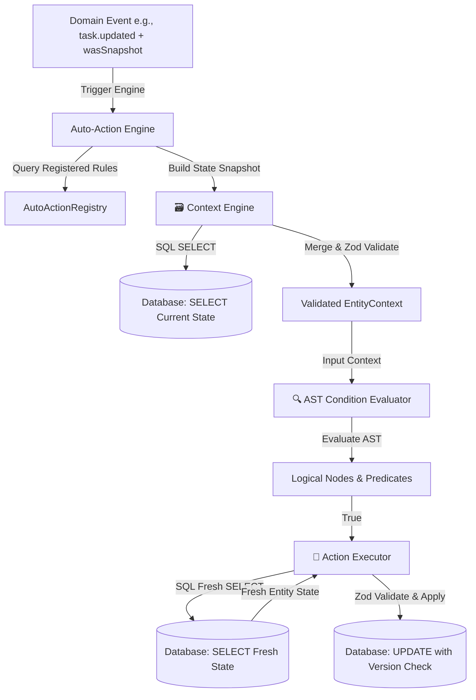

# Internal Architecture & Design Guarantees

This document details the high-performance design patterns, structural choices, and concurrency safety guarantees implemented within the `auto-action` automation module.

---

## 1. Architectural Blueprint

The modular automation engine is structured around decoupled components that interact statelessly, mediated by a centralized Context Engine that builds type-safe snapshots:



---

## 2. Core Architectural Guarantees

### 2.1 Stateless, Pure-Context Condition Evaluation
To achieve sub-millisecond execution times and eliminate database roundtrips during logic checks, the condition evaluation engine operates as a **pure-functional** component:
* **No Database Operations**: There are **zero** database queries or asynchronous calls inside `evaluator.ts` or any `ConditionDefinition.evaluate()` implementation.
* **Context Reconstruction by Context Engine**: Prior to evaluation, the **Context Engine** dynamically resolves the target entity from the database, normalizes it, overlays historical transition data from `wasSnapshot` payloads onto `prev_` columns, and validates the entire payload against strict Zod schemas (e.g., `TaskContext`).
* **Context Snapshots**: The resulting validated context (e.g. `TaskContext`) carries both `prev_` and `current_` properties for all fields. The evaluation engine performs simple, inline comparisons on these values (e.g., `prevValue !== currentValue` or `currentValue === to`).
* **Sub-Millisecond Speed**: Because evaluations are simple, local comparisons, checking complex, nested logical rules takes under `1ms` and avoids database connection pool exhaustion.

### 2.2 Fresh-Fetching in Actions
While trigger contexts carry lightweight snapshots for condition checking, the system **never** applies action mutations directly to the snapshot data. Instead, it enforces a **Fresh-Fetch Pattern**:
1. When an automation rule fires and its conditions evaluate to `true`, the action executor receives the target entity identifier (e.g. `taskId`).
2. The action immediately executes a **SELECT query** against the database to retrieve the absolute latest, fresh state of that task.
3. This ensures that even if concurrent events or background processes updated the task between the event trigger and action execution, the action is working with accurate, up-to-date data.

### 2.3 Optimistic Concurrency Control (OCC)
In high-throughput environments (targeting 10k+ RPS), multiple concurrent automations might attempt to modify the same task at the same time. To protect against the **Lost Update Problem**, the module utilizes optimistic locking:
* **Version Tracking**: Every entity (e.g., Task) maintains a numeric `version` column.
* **Atomic Updates**: When writing changes back to the database, actions execute a query structured as:
  ```sql
  UPDATE tasks 
  SET status = :newStatus, version = :newVersion, ... 
  WHERE id = :taskId AND version = :expectedVersion;
  ```
* **Failure Detection**: The database returns the number of rows updated. If `0` rows were updated, it indicates that another thread or request committed a change first, changing the version number.
* **Concurrency Recovery**: When an optimistic lock check fails, the system immediately throws a concurrent update error, prompting the application transaction to abort and roll back safely, maintaining full state consistency.
