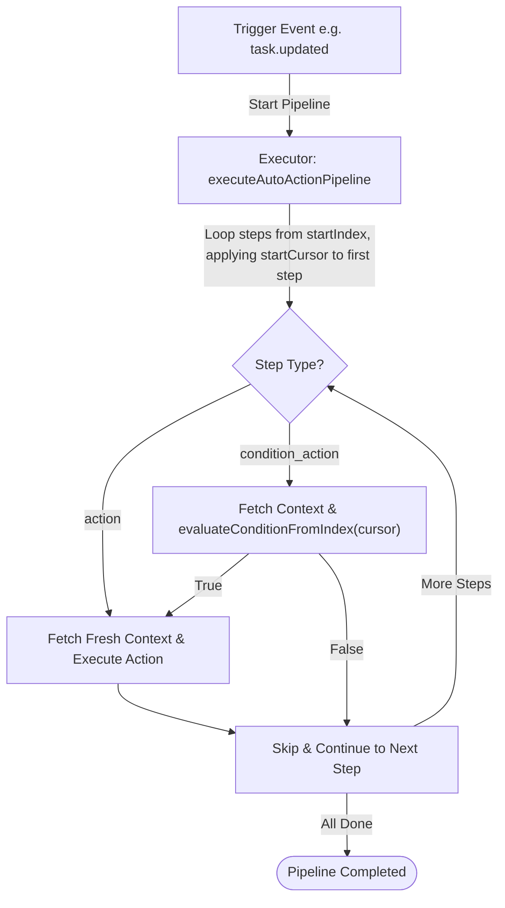

# Auto Action Orchestration & Pipeline Execution

This document details the architecture, execution pipeline, safety boundaries, and suspension/resume mechanics of the **Auto Action Engine** orchestrator.

---

## 1. Pipeline Execution Flow

The Auto Action Engine acts as the central orchestrator that coordinates the **Context Engine**, **Condition Engine**, and **Action Engine** to run dynamic, multi-step rule pipelines.

Auto-actions define a list of sequential steps (`PipelineStep`), which can be of two types:
1. **Action Step (`action`)**: Directly executes a registered action using fresh context and provided static inputs.
2. **Condition-Action Step (`condition_action`)**: Evaluates a registered AST condition against fresh context. If and only if the condition evaluates to `true`, it executes the corresponding registered action.



---

## 2. Persistent Transition State (`prev_` columns)

To accurately evaluate field transitions (e.g., *"status changed from `TODO` to `IN_PROGRESS`"*), the engine requires the previous state of each task field. This is stored **directly in the `project_task` database table** as persistent `prev_` columns — not derived from transient event payloads.

### 2.1 Persisted Columns

The following `prev_` columns exist in `project_task`:

| Column | Type | Written by |
|---|---|---|
| `prev_status` | `TEXT` | every task `UPDATE` |
| `prev_priority` | `INTEGER` | every task `UPDATE` |
| `prev_title` | `TEXT` | every task `UPDATE` |
| `prev_team_id` | `UUID` | every task `UPDATE` and team unassign operations |
| `prev_member_id` | `TEXT` | every task `UPDATE` and member unassign operations |

### 2.2 Atomic Write Pattern

Every task update query atomically copies the **current** column values into their `prev_` counterparts in the same `UPDATE` statement before overwriting them:

```sql
-- Inside updateTask CTE:
UPDATE project_task SET
    prev_status    = status,
    prev_priority  = priority,
    prev_title     = title,
    prev_team_id   = fk_team_id,
    prev_member_id = fk_member_id,
    -- ... actual new values follow
WHERE id = $1 AND version = $2
```

For Kysely-based builders (e.g., `orphanTasksByTeamIdsBatch`), this uses `eb.ref()` to reference the live column value at the time of the statement:

```typescript
.set((eb) => ({
    prev_team_id:   eb.ref('fk_team_id'),
    prev_member_id: eb.ref('fk_member_id'),
    fk_team_id:     null,
    fk_member_id:   null,
}))
```

### 2.3 Context Engine Priority Chain

When `fetchContext` builds the context at each pipeline step, it reads `prev_` values using the following priority:

```
1. DB prev_ column (non-null)   ← primary source of truth
2. wasSnapshot field             ← fallback for the initial trigger only
3. null
```

This means every step in a multi-step pipeline automatically sees the transition state produced by the **previous step's write**, not the stale event payload from the original trigger. This is what makes the engine safe under concurrent execution — multiple auto-actions running in parallel all read from the same authoritative database state.

---

## 3. Strict Sync/Async Boundaries

To protect main-thread event loops from resource starvation and slow external requests, the orchestrator enforces **strict execution isolation**:

1. **Definition Isolation**: Every Action and Condition registered in the engines exposes a static boolean flag: `isAsync`.
2. **Sync Flow Enforcements**: When creating or updating an auto-action, if the `is_sync` flag is set to `true`:
   * The manager performs a compile-time static check on all steps.
   * If even a **single step** references an asynchronous action or an asynchronous condition, the registration/update is rejected with a validation error.
   * A synchronous pipeline is thus guaranteed to have **zero** blocking operations or remote network requests.
3. **Template Filtering**: When rendering the dynamic catalog of available components for the UI, the system filters out all asynchronous definitions when in sync mode, ensuring users cannot accidentally select incompatible steps.

---

## 4. Suspendable Execution & Serialized State

The pipeline execution loop is designed from the ground up to be **suspendable and resumable**, providing a robust foundation for future batch scheduling and event-driven async chunking:

* **Indexed Execution**: `executeAutoActionPipeline` accepts an optional `startIndex` parameter (defaulting to `0`).
* **Stateless Per-Step Fetching**: At each index iteration, the executor performs a fresh `fetchContext` database call, ensuring that even if execution is suspended and resumed later, each step is evaluated against the absolute latest data.
* **State Return**: The executor returns a serialized execution state:
  ```typescript
  interface PipelineResult {
      completed: boolean;
      lastProcessedIndex: number;
  }
  ```
  The orchestrator can resume execution by invoking `executeAutoActionPipeline` with `startIndex = lastProcessedIndex + 1`, picking up exactly where the pipeline left off without re-running completed side effects.

---

## 5. Condition Splitting (`StepResumeCursor`)

For very long condition trees inside a `condition_action` step, the engine supports **splitting the condition evaluation** — evaluating children `0..N-1` in one batch and resuming from child `N` in the next, without re-evaluating earlier children.

### 5.1 `StepResumeCursor`

```typescript
export interface StepResumeCursor {
    conditionChildIndex?: number;
}
```

When `conditionChildIndex` is set to `N > 0`, the condition evaluator skips children `0` through `N-1` and evaluates only from child `N` onwards. This applies **only** to the top-level node when it is a logical `AND`.

### 5.2 `evaluateConditionFromIndex`

A dedicated, isolated pure function in `conditionEngine.ts`:

```typescript
export function evaluateConditionFromIndex(
    node: ConditionNode,
    ctx: any,
    startChildIndex: number,
): boolean
```

**Splitting rules:**

| Scenario | Behaviour |
|---|---|
| Top-level `AND`, `startChildIndex > 0` | Evaluates only children `[startChildIndex, end]` |
| Top-level `AND`, `startChildIndex === 0` | Falls through to full `evaluateCondition` |
| Top-level `OR` or `NOT` | Splitting not applicable — full evaluation runs |
| Leaf predicate | Splitting not applicable — full evaluation runs |

### 5.3 Pipeline Integration

The cursor is threaded through as `startCursor` on `executeAutoActionPipeline`:

```typescript
await executeAutoActionPipeline(
    autoActionId,
    entityId,
    actorId,
    traceId,
    wasSnapshot,
    startIndex,                  // resume at this step
    { conditionChildIndex: 3 },  // resume condition from child 3
);
```

The `startCursor` is applied **only to the first step executed** in the current run. All subsequent steps always begin their condition evaluation fresh from child `0`. This keeps the pipeline loop fully decoupled from condition engine internals — the loop passes the cursor opaquely.

---

## 6. Extension Points for Future Async Optimisations

Every future async optimisation can be plugged in by replacing or wrapping a **single boundary** — nothing else needs to change:

| Future Feature | Extension Point |
|---|---|
| Batch condition processing | Wrap `evaluateConditionFromIndex` call inside `executeAutoActionStep` |
| Event-driven step chunking | Serialise `{ lastProcessedIndex, conditionChildIndex }` to Kafka/Outbox; resume via `executeAutoActionPipeline(startIndex, startCursor)` |
| Throttled / queued async actions | Replace `executeAction` call in `executeAutoActionStep` with a queued dispatcher |
| New entity scopes | Register a new `ContextResolver` in the registry — no changes to executor, condition engine, or action engine |
